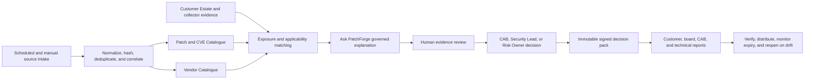

# PatchForge Automation and UI Readiness Review

Date: 2026-07-11

Review type: repository-grounded architecture, delivery, workflow, UI, intelligence, reporting, and operational-readiness review

## Outcome

PatchForge has a credible governed-intelligence foundation and a coherent six-area operating model, but the current build is **not yet fully automated or supportable as a customer-production release**.

The local build and automated suites pass after the changes in this review. The most important trust-boundary defects found in pack generation, approval attribution, finding correlation, source review, report snapshots, UI selection, and scheduler freshness have been corrected. Four hard release blockers remain:

1. canonical release records do not describe the most recently evidenced Azure image state;
2. production Bicep parameters do not faithfully describe the live PostgreSQL-backed topology;
3. evidence review and signed-report integrity are not yet an end-to-end server-owned workflow;
4. current signed-in user acceptance and real customer collector acceptance are not evidenced.

Automation must stop at accountable human gates. PatchForge can automate intake, normalization, correlation, prioritization, evidence compilation, freshness checks, report preparation, signing, verification, and notifications. It must not autonomously approve a change, accept risk, close a hard evidence gate, deploy a patch, or claim customer readiness.

## Reviewed State

- Branch: `codex/patchforge-rebuild-20260601`
- Reviewed HEAD: `36db312d69836f101b9a0eb9edf05ee5e308eed3`
- Worktree: dirty before this review and still dirty; pre-existing package, documentation, deployment-plan, and June 2026 evidence changes were preserved.
- Canonical release record: `PF-AZ11-CUSTOMER-DEMO-MATURITY`, with signed-in UAT and fresh report proof still pending.
- Later Azure evidence: all six apps were updated on 2026-06-22 to `pfaz-container-20260622-36db312-wt80d309b2`, built from a dirty worktree. That evidence explicitly does not claim signed-in or customer acceptance.
- Current information architecture: the approved `ADR-PF-UX-001` six-area flow supersedes older seven-area descriptions.
- Cloud scope: no Azure, Entra, DNS, Key Vault, database, ACR, or production resource was changed during this review.

## Implementation Progress Update — 2026-07-14

The July 11 findings remain the review baseline. The current working candidate addresses the implementation portion of the ten backlog tickets, with live release and human acceptance still separate. See the [14-Area Improvement Closure Matrix](PATCHFORGE_14_AREA_IMPROVEMENT_CLOSURE_2026-07-14.md) for the detailed implementation, operator, validation, and stop-condition mapping.

| Backlog ticket | Candidate status | Still required before closure |
| --- | --- | --- |
| PF-REL-001 | Release approval/provenance workflow and guarded publisher implemented locally | Clean commit, remote checks, approval attestation, Azure rollout/readback, signed-in UAT, report proof, cleanup, and canonical release-record refresh |
| PF-IAC-001 | Existing/create/disabled PostgreSQL model and explicit live resource posture implemented locally | Final approved what-if and Azure readback; no database/storage replacement or deletion may be inferred as acceptable |
| PF-OPS-001 | Probes, dependency-aware readiness, guarded release checks, rollback preparation, and operational SLO signals implemented locally | Injected-failure/recovery evidence and live six-app rollout/readback |
| PF-EVID-001 | Server-owned, finding-scoped submission/review/reject/reopen/expiry workflow and UI queue implemented locally | Final combined suite plus signed-in role journey |
| PF-SEC-001 | Outbound URL/DNS/IP/redirect/size/time controls and server-owned AI evidence context implemented locally | Final combined security suite and production configuration readback |
| PF-REPORT-001 | Append-only exact-byte export records and JSON/ZIP/DOCX/PDF digest coverage implemented locally | Fresh production artifacts, byte/member verification, and visual DOCX/PDF review |
| PF-UI-001 | Explicit verified-pack selector, finding evidence queue, stable context, partial-load retry, lazy areas, keyboard/focus, and responsive behavior implemented locally | Final clean build/E2E and signed-in production UAT |
| PF-COLLECTOR-001 | Fail-closed package verification, least-privilege setup, heartbeat, lifecycle, upgrade/revoke/uninstall, and recovery controls implemented locally | Trusted PatchForge signature, clean Windows VM, offline/retry proof, and representative customer acceptance |
| PF-AUTO-001 | Idempotency, leases, checkpoints, bounded retry, dead-letter/quarantine, replay/reconciliation, worker loop, SLOs, and alerts implemented locally | Final combined suite and live worker/scheduler health and backlog proof |
| PF-QUAL-001 | Pinned CI, dependency/security scans, SBOMs, attestations, browser accessibility journey, bundle budget, and protected production approval workflow implemented locally | Remote workflow execution, branch/environment enforcement, and retained release evidence |

The table above records the pre-release candidate state at the time of the implementation pass. The following dated update records the subsequent controlled rollout and signed-in UAT evidence.

## Live Image Rollout and Signed-In UAT Update — 2026-07-14

- Protected production approval run `29345354677` authorized source commit `f51802d3544260259c252e6be88d6e7bae596868`, image tag `pfaz-enterprise-20260714d-f51802d`, baseline `PF-AZ-ENTERPRISE-AUTOMATION-20260714D`, and report context `patchforge-report-context.pfaz-enterprise-20260714d.v1`.
- The image-only publisher completed successfully for all six Container Apps. The release evidence records each immutable image digest and healthy revision, a verified ES256 provenance manifest with SHA-256 `d9c8f265aaab5c7d10549f1730620a9681bb0b13ff10c8b870973f52c07b9615`, successful public UI/health/readiness/protected-route smoke checks, and post-release removal of the direct signing-key role assignment.
- Signed-in `PatchForge.Admin` health UAT passed 13 of 13 checks. Broader role-based UAT is not yet evidenced.
- The DOCX report journey failed closed with `signature_cryptographic_verification_failed`. The high-confidence root cause is Azure enum labels `KeyType.ec` / `KeyCurveName.p_256` reaching a standards-form JWK verifier. The closeout branch strictly normalizes recognized values to `EC` / `P-256` and retains full ES256 verification; unknown aliases/curves, malformed coordinates, wrong keys, and tampered/short signatures fail. Navigation, verified ZIP export, and exact-ID cleanup are also implemented/tested locally. None of these changes is live.
- Full Bicep was not applied. The latest What-If is 43 resources: 0 destructive, 7 modify, 20 no-change, 3 ignore, 13 unsupported; 0 image changes, 0 environment removals, metadata on six apps, +12 probes, and scheduler-only `min0→1` because its timer is in-process. Separate exact approval remains mandatory.
- Separate closeout-branch validation passed locally: Python 53/53, backend 94/94, frontend 28/28, Playwright/axe 2/2, collector 8/8, frontend build/bundle PASS with entry `270.20 kB` and total `634.39/650 kB`, and IaC PASS. These totals do not replace the deployed `f51802d` candidate evidence.
- Trusted collector signing, clean customer-machine/customer UAT, and legal/licensing closure remain open.

Result: the controlled image rollout passed, but overall release acceptance remains **partial**. Details and sanitized evidence are in the [Current Release](../../CURRENT_RELEASE.md) and [2026-07-14 image rollout evidence](../release/evidence/2026-07-14-patchforge-enterprise-image-rollout/README.md).

## Intended Operating Flow

The workflow should run automatically from source intake through report preflight. The two explicit manual controls are evidence acceptance and accountable approval/risk acceptance. Any source-content change, expired acceptance, signature failure, stale source, or changed customer scope must invalidate the relevant decision and reopen the workflow.

## Information Each UI Area Must Provide

| Area | Required user information and actions | Required durable output |
| --- | --- | --- |
| Patch & CVE Catalogue | Source and source URL, last fetched and next refresh, source hash, review state, CVSS/EPSS/KEV state, patch status, customer matches, confidence, conflicts, blockers, and the reason a priority was assigned. Users need refresh, filter, inspect, link evidence, and request review actions. | Source-bound vulnerability record, refresh audit event, review event, and finding-scoped intelligence snapshot. |
| Vendor Catalogue | Clearly visible selected asset and advisory, vendor/product/firmware scope, applicability match and non-match reasons, evidence age, vendor-source provenance, comparison result, and missing configuration evidence. | Selected-context assessment bound to exact asset and advisory identifiers. |
| Customer Estate | Import/discovery source, ownership, environment and criticality, last seen, evidence confidence, mapping status, affected/unaffected rationale, stale records, collector heartbeat, and records needing review. | Tenant-scoped asset evidence with source lineage, review state, and correlation history. |
| Ask PatchForge | Deterministic answer, supporting sources, assumptions, ambiguity, missing evidence, what would change the answer, current blockers, next permitted action, advisory boundary, and optional AI-verifier status. | Reproducible advisory snapshot that cannot approve, patch, accept risk, or close evidence gates. |
| Reports | Explicit pack selector, pack creation time, product baseline, renderer/image metadata, immutable decision-time snapshot, current-state differences, evidence completeness, approval lineage, expiring risk acceptances, signature verification, and audience-specific export actions. | Immutable manifest plus signed artifact digests for each exported ZIP, DOCX, and PDF. |
| Admin | Deployed version/revision, API/runtime/storage/signing health, liveness/readiness status, source scheduler last success/next run/lag, retry and failure ledger, worker backlog, collector health, alert state, and safe diagnostic/retry actions. | Auditable operational events, actionable health state, and alert/incident evidence. |

## Corrections Completed in This Review

### Trust and governance

- Aligned all signed-pack route aliases to the same elevated-role requirements and prevented triage-role alias bypass.
- Bound review and approval actors to the authenticated principal rather than trusting request-body identities or roles.
- Prevented client-submitted evidence items from satisfying hard gates.
- Required server-verified CAB/Admin approval for a final approval event and blocked expired risk acceptance.
- Mapped workflow postures to the correct governance evidence models.

### Intelligence and report correctness

- Scoped reviews to the current finding instead of accepting unrelated tenant reviews.
- Replaced CVE substring matching with exact identifier correlation.
- Included governed customer-network assets in finding intelligence.
- Made stored EPSS values contribute to deterministic Bayesian analysis.
- Made reports prefer the immutable decision-pack intelligence snapshot over later live state.
- Made product baseline and renderer metadata server-authoritative.

### Source freshness and operational health

- Preserved a reviewed source only when a repeat ingestion has the same content hash.
- Recomputed source and vulnerability revisions from canonical server-side content so replaying a caller-supplied hash cannot preserve trust.
- Invalidated review state when source content changes and recorded that invalidation.
- Invalidated vulnerability review when material top-level facts change, even when no source array is resubmitted.
- Allowed authoritative `false` corrections for KEV, exploitation, exposure, OT relevance, and patch-availability flags.
- Prevented new vulnerability ingestion from self-asserting trusted review states.
- Marked old scheduler evidence stale/degraded instead of presenting historical success as current health.
- Required explicit scheduler configuration and scheduler-owned run markers; manual refresh history no longer proves scheduler health.

### UI workflow

- Modernized the six-area enterprise shell with a responsive navigation drawer, named global and queue search landmarks, source/account context, focus treatment, and mobile-first layout behavior.
- Replaced the wide catalogue register with a deduplicated priority queue, supported quick filters, a five-step governed runway, truthful operational summaries, and a persistent selected-record intelligence panel.
- Ensured rejected, pending, or unreviewed evidence cannot be displayed as verified through substring matching.
- Prevented catalogue pack, Ask, and comparison actions from inheriting an unrelated fallback asset or advisory.
- Kept advisory report preparation independent from final approval while continuing to show approval as not issued until an accountable human records it.
- Kept the selected Vendor Catalogue asset/advisory through applicability assessment and pack generation.
- Stopped the UI from injecting hard-coded release metadata into packs.
- Replaced static trusted-signing indicators with actual verification-aware states.
- Restricted signed-report downloads to verified packs pending an explicit pack selector.
- Filtered assessment, chat, comparison, and pack inputs to the exact selected asset/advisory context.
- Gave CAB approvers read access and pack-generation capability without enabling triage actions.
- Made the navigation collapse control functional and accessible.
- Corrected the visible DIIaC trademark escape defect.

### Delivery automation

- Added Windows collector syntax, unit-test, and PowerShell parser checks to CI.
- Added documented API syntax and collector test commands to the validation entry points.
- Added regression coverage for every correction above.
- Added an explicit 30-second Vitest integration timeout so the full jsdom workflow suite remains fail-closed without becoming load-sensitive on constrained Windows runners.

## Prioritized Delivery Backlog

### PF-REL-001 — Re-establish reproducible release truth

- Priority/owner: P0, Release Engineering and Product Owner
- Problem: `CURRENT_RELEASE.md` and `QUALITY_GATES_REPORT.json` describe PF-AZ11/June 2026 images, while later Azure evidence describes a six-image deployment from HEAD `36db312` plus a dirty-worktree hash.
- Change: choose an approved baseline, rebuild all images from a clean immutable commit, record digests and active revisions, run the full gate set, then update the canonical release records from generated evidence.
- Verification: clean worktree attestation; commit-to-image provenance; six ACR digests; active/latest-ready revision readback; public smoke; signed-in six-area UAT; fresh pack and DOCX/PDF inspection; cleanup and human release approval.
- Stop rule: do not claim a release from a dirty or unattributable build, or when any canonical record, digest, revision, or runtime metadata disagrees.

### PF-IAC-001 — Reconcile Bicep with the live PostgreSQL topology

- Priority/owner: P0, Platform Engineering
- Problem: production parameters still set `createPostgres = false` and `imageTag = 'bootstrap'`, and the template can emit local-JSON placeholders, while live evidence depends on PostgreSQL. A previous full what-if showed broad drift outside image tags.
- Change: import/model existing resources, make storage and image intent explicit, add environment-specific parameters, and keep image-only rollout separate from full topology deployment.
- Verification: a captured what-if contains only approved changes; no database replacement/deletion; storage mode and health readback match; rollback is rehearsed.
- Stop rule: freeze full Bicep apply until unexplained modifications and unsupported changes are zero or individually approved.

### PF-OPS-001 — Make deployment and runtime health fail closed

- Priority/owner: P0, Platform Engineering/SRE
- Problem: key Azure/Docker scripts can continue after native-command failure, Container Apps lack explicit probes, and the June update exposed a stopped database only after public API failure.
- Change: wrap every native call with exit-code/output validation, emit machine-readable evidence, add liveness/readiness/startup probes, preflight PostgreSQL and signing dependencies, verify all six apps, and invoke a tested rollback on failed gates.
- Verification: injected command failure causes non-zero exit and no success message; stopped dependency fails readiness before traffic cutover; rollback restores the prior digest; alert fires with an actionable reason.
- Stop rule: no push, traffic change, or completion claim after a failed or ambiguous native command.

### PF-EVID-001 — Complete the server-owned evidence and review workflow

- Priority/owner: P0, Governance Engine and Frontend
- Problem: client hard-gate claims are now ignored, but not every source class has a complete server-owned path from pending evidence to reviewed evidence. The UI does not yet provide a complete, finding-scoped review/approve experience.
- Change: create a server evidence compiler for each allowed evidence class; require evidence IDs, hashes, reviewer principal, role, timestamps, expiry, and finding/asset/advisory scope; add queue, review, rejection, conflict, and reopen actions to the UI.
- Verification: forged client evidence and cross-finding reviews fail; an authorized reviewer can legitimately satisfy each supported gate; changed evidence or expiry reopens the decision; audit replay reproduces the result.
- Stop rule: final approval remains impossible until all required evidence is persisted, verified, unexpired, and linked to the exact decision context.

### PF-SEC-001 — Harden external intelligence and optional AI boundaries

- Priority/owner: P0, Security Engineering
- Problem: vendor-source URL intake needs an outbound allowlist/SSRF boundary, and optional AI verification must not trust caller-supplied evidence booleans.
- Change: allowlist schemes/hosts, reject private/link-local/metadata addresses after DNS resolution, cap redirects/size/time, and construct AI-verifier evidence exclusively from server records.
- Verification: SSRF corpus and DNS-rebinding tests pass; private targets are unreachable; forged verifier flags have no effect; refusal and advisory-only tests remain green.
- Stop rule: disable arbitrary vendor URL refresh and optional AI claims until both paths are server-verifiable.

### PF-REPORT-001 — Make exported artifacts genuinely immutable and verifiable

- Priority/owner: P1, Governance Engine/Reporting
- Problem: the UI promises a signed ZIP/verification experience, but exported report artifacts are not all represented by immutable signed digests, and storage immutability is not enforced strongly enough.
- Change: use append-only pack versions, sign a manifest containing every report digest, export an actual ZIP bundle, verify each file on download, and retain the decision-time/current-state distinction.
- Verification: modifying any JSON, DOCX, PDF, or ZIP member fails verification; an older pack remains reproducible after live intelligence changes; a pack cannot be overwritten by ID.
- Stop rule: label outputs "generated, not signed" unless the exact downloaded bytes are covered by the verified manifest.

### PF-UI-001 — Finish the guided operator experience

- Priority/owner: P1, Frontend/Product Design
- Problem: users still need an explicit pack selector, executable review gates, partial-load resilience, clearer selected-context/freshness states, and scalable catalogue rendering.
- Change: add persistent context breadcrumbs, step status, blockers and next action, per-panel error/retry states, pagination/virtualization, accessible keyboard/focus behavior, and lazy-loaded major areas.
- Verification: signed-in role-based journey tests; accessibility scan; large-catalogue performance test; one failed API panel does not blank the page; downloaded report always matches the selected pack.
- Stop rule: do not infer selection from array order or silently switch packs after refresh.

### PF-COLLECTOR-001 — Operationalize the Windows collector

- Priority/owner: P1, Endpoint Engineering and Customer Success
- Problem: the Windows EXE/package exists, but trusted code signing, unattended least-privilege authentication, scheduled operation, heartbeat visibility, upgrade/revoke flow, and real customer-environment UAT are incomplete.
- Change: sign the package, replace interactive operator login with an approved least-privilege identity, add install/upgrade/uninstall automation, heartbeat and last-seen UI, spool/retry, revocation, and an evidence-led customer setup wizard.
- Verification: clean Windows VM install; signature verification; least-privilege auth; offline/retry recovery; duplicate-safe import; revoke/uninstall; real customer or representative UAT.
- Stop rule: do not describe the collector as fully unattended or customer-ready until those proofs exist.

### PF-AUTO-001 — Turn schedulers/workers into a resilient ingestion service

- Priority/owner: P1, Backend/SRE
- Problem: source refresh lacks a consistent cursor/checkpoint, bounded retry, dead-letter/failure ledger, reconciliation, and observable worker lifecycle; the worker image must run a real work loop.
- Change: implement idempotency keys, per-source cursors, backoff/jitter, poison-record quarantine, run leases, replay/reconciliation, SLOs, alerts, and UI-visible failure reasons.
- Verification: restart mid-page without duplication; replay produces identical hashes; poison input is isolated; stale/failed runs alert; backlog drains within the agreed SLO.
- Stop rule: no scheduler success when any required page, checkpoint, or persistence operation is ambiguous.

### PF-QUAL-001 — Close CI, security, and release-gate coverage

- Priority/owner: P1, Quality/DevSecOps
- Problem: CI now covers the collector, but still needs signed-in end-to-end journeys, artifact/report rendering verification, dependency/secret/container/IaC scans, availability tests, and enforced branch/environment protections. The frontend bundle remains above Vite's 500 kB advisory threshold.
- Change: add Playwright role journeys, report render/digest tests, SBOM and signed-image provenance, security scanners, deployment-environment approvals, required checks, and route-level code splitting.
- Verification: protected branch cannot merge without all gates; staged deployment cannot promote without human approval; generated artifacts are attached to the run; performance and accessibility budgets pass.
- Stop rule: no automated production promotion from an unprotected branch or without artifact provenance and explicit environment approval.

## Validation Performed

| Command/gate | Result |
| --- | --- |
| Python runtime/governance tests | PASS, 30 tests |
| Backend API tests | PASS, 62 tests |
| Frontend tests | PASS, 20 tests |
| Frontend production build | PASS; 595.65 kB JavaScript chunk, Vite size advisory remains |
| Windows collector tests | PASS, 5 tests |
| Backend syntax check | PASS |
| Bicep/IaC validation | PASS; Azure CLI reported an available Bicep update |
| Local authenticated-preview browser render | PASS for desktop and 390 x 844 responsive views; filtering, record selection, mobile navigation, and zero console warnings/errors verified; production MSAL role journey not exercised |
| `git diff --check` | PASS, line-ending conversion warnings only |

## Completion Gates

PatchForge can be described as fully automated within its governed boundary only when all of the following are evidenced:

1. a clean source commit produces attributable, signed, scanned images and artifacts;
2. IaC and live topology agree, with a safe what-if and tested rollback;
3. intake is idempotent, resumable, observable, and failure-aware;
4. evidence and approvals are server-owned, scoped, attributable, expiring, and replayable;
5. reports are generated from an explicit immutable pack and every downloaded byte verifies;
6. the UI exposes selection, freshness, confidence, conflicts, blockers, allowed next action, and operational failures;
7. signed-in role journeys, accessibility, performance, report rendering, and customer collector UAT pass;
8. release approval remains an explicit accountable human decision.

Until then, the safe statement is: **the local build is green and materially hardened, while production release, signed-in UAT, report-integrity, infrastructure-reconciliation, and collector-acceptance gates remain open.**
